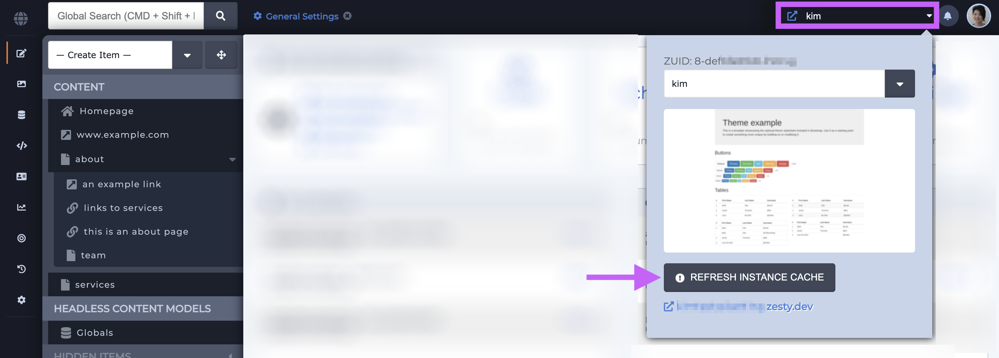

# Refreshing the Cache

### Overview

Caching allows for data to be stored and quickly retrieved when requests are made. However, sometimes when a cached item is updated you may not see the updates you've made even after you published them to the live site even though you can see the changes in preview. When that happens refreshing the cache \(also known as busting the cache\) purges the stored items and retrieves the latest items for storage. Once the cache is refreshed users will be able to see the updates that they've made. 

Learn more about caching [here](https://en.wikipedia.org/wiki/Cache_%28computing%29).

## Refreshing Cached Items

### Steps to Refresh Cached Item\(s\) 

1. Locate the item that needs its cache refreshed and select it.

2. In the editing view scroll down until you see Refresh Cached Item button in the right-hand sidebar and click it.

3. A green success notification will show in the lower right-hand corner.

4. Hard-refresh the live site and view your changes. 

## Refreshing the Instance Cache


Only user roles with publishing privileges can access this feature.


1. From any section in the content manager access the main instance menu in the upper right-hand corner by clicking on it. Then from the dropdown click on the **Refresh Instance Cache** button.

**Note:** If you have a large number of pages it may take some time for all of the pages refresh.

