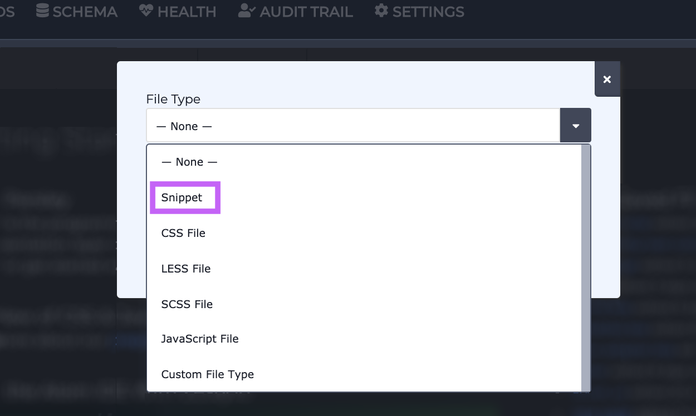
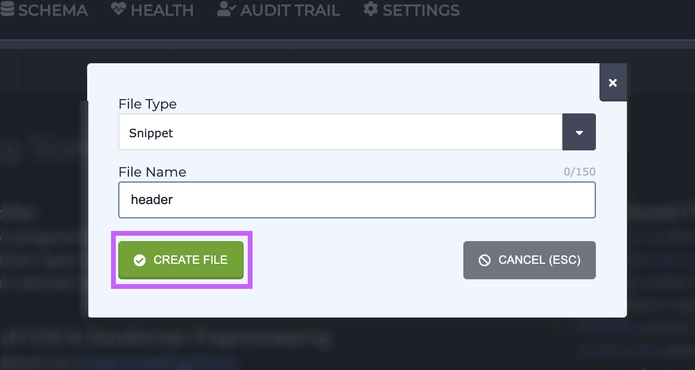
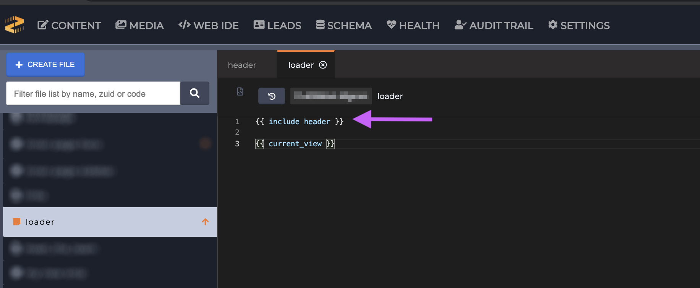
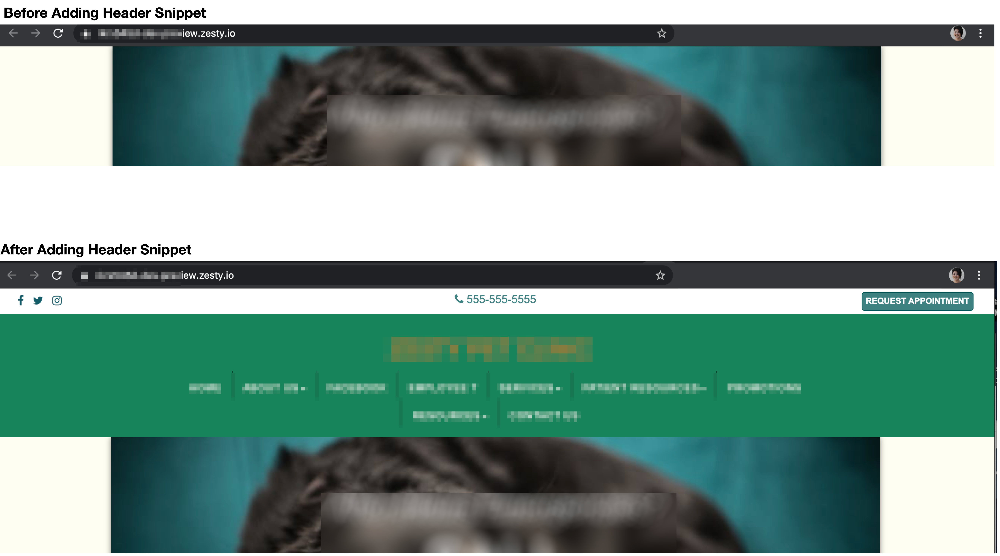
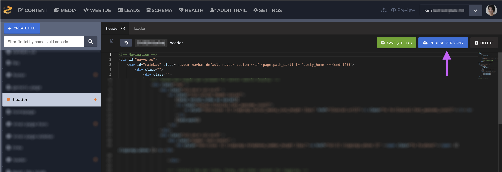

# Using Snippets

###  Overview 

The code in Views can get pretty crowded with code depending on what you're working on. [Snippets](https://zesty.org/glossary#snippet) can make all that code more modular and easy to manage by allowing user to abstract complicated and repeated pieces of code into a separate file. When you want to include your abstracted code into a view, use the Parsley [`{{ include }}`](https://zesty.org/services/web-engine/introduction-to-parsley/include) call. 

### Common Use Cases 

There are several common use cases that Snippets are commonly used for: 

* Headers 
* Footers 
* Sidebars 
* Navigation bar\(s\) 

While these are common use cases, more complex pieces of code can be abstracted as well. For example, it may be easier to work on a large form when it's abstracted into its own Snippet, or a complex in-View script may be easier to work when it's not surrounded by a View's HTML. 


The Loader, which comes with every single Zesty.io instance, is a Snippet. This file allows for views to be rendered using the [`{{ current_view }}`](https://zesty.org/services/web-engine/introduction-to-parsley/parsley-index#current_view) call. 


### Creating Snippets 

For this guide we're going to be making a simple header for our website. We are starting at the last step of the [Schema-Content-Code](https://zesty.org/guides/the-connection-between-schema-content-and-code) process: coding it all in. If you need a refresher on how Zesty.io works refer to these articles: [create an instance](https://zesty.org/guides/how-to-create-a-new-instance), [build the Schema](https://zesty.org/guides/building-the-schema-and-selecting-fields), and [add Content](https://zesty.org/services/manager-ui/content/adding-and-managing-content) before jumping into the Web IDE to code it all in. 

1. Navigate to the Web IDE.

2. Create the blue Create File button. Note: depending on your screen size you'll simple see a blue button with a + sign on it.

3. Select Snippet from the dropdown.

4. Give it a name. There is no need to add an extension to the file name. 

5. Click Create.

### Using Snippets

When working on your Snippet you'll need to include it in a view in order to preview your changes. Since we're working on a header that we want to be on every single page, we're going to add our Snippet to the [Loader](https://zesty.org/services/manager-ui/editor/outputting-content#loader) which loads every view.

After creating your Snippet: 

1. Include your snippet in a View so you can view your changes as you're coding.

2. Code your Snippet as necessary.

3. Save your changes. 

4. preview them before sending them live.

5. Once you're satisfied with the code in your Snippet, send it live by publishing it.


To send snippets live both the snippet _and_ the view that the snippet is included in need to be published.


