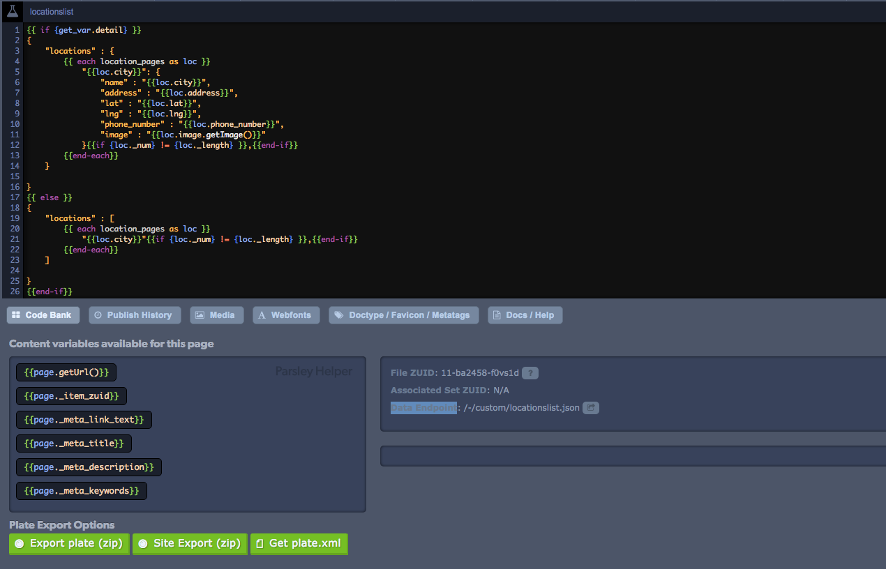

# Pull Zesty

`PullZesty` is a [npm](https://npmjs.com) package created to assist you in pulling content from Zesty.io. It streamlines the process and is extremely customizable to your needs. `PullZesty` is most easily used for integrating with `React`, `Ruby on Rails`, `Hugo`, and `Jekyll`. For `Swift`, we instead recommend using the `ZestySwiftContentEndpointWrapper`, a library made specifically for iOS / macOS Development.

Additionally, if you ever want more functionality, you can [submit a request](https://chat.zesty.io), or also create it yourself using the [BasicJSON](https://developer.zesty.io/guides/api/basic-api-json-endpoints-guide/) and [Custom Endpoints](https://developer.zesty.io/docs/code-editor/customizable-json-endpoints-for-content/) API, using simple GET Requests.

## How it Works

Using `pullzesty` is simple. Simply run

```text
pullzesty zesty.yaml
```

where `zesty.yaml` is your config file \(explained in detail below\).

Optionally, you can also add the `--verbose` flag to see where each file is created.


Note that in order to use `pullzesty`, you will need to [enable Basic JSON Endpoints](https://developer.zesty.io/guides/api/basic-api-json-endpoints-guide/).


## Understanding `zesty.yaml`

Your zesty.yaml file defines the structure of where your data will be downloaded and refreshed to, as well as what data is downloaded.

### Example `zesty.yaml` File



```yaml
instanceURL: http://burger.zesty.site # this is the url of your zesty site
contentZuids:
    items: # templateset / single pages
        6-4ac048-ksk3gq: content/homepage.md
        6-adc030-h0lgs4: content/blog.md
        6-4b5c74-fg83s2: content/about.md
        6-524458-d5wjpw: content/events.md
        6-f5f094-ggchl1: content/careers.md
        6-2c1804-2w70lf: content/locations.md
        6-e8ebe0-1wns63: content/menu.md
        6-693008-j6h1nv: content/usa_locations.md
    arrays: # pagegroup pages
        6-552d64-9rp79b: content/articles
        6-8d6f30-zc84qx: content/event_list
        6-9bfe5c-ntqxrs: content/location_pages
        6-ca7ed0-bx3vpj: content/local_events
        6-192984-tjwntl: content/career_list
        6-4a7e40-3sld16: content/foods
        6-1efbc8-c4x74s: content/drinks
        6-df06e8-np6wzp: content/local_careers_list
        6-94ecbc-pzz5cr: content/local_menu
        6-bfb9d0-5tpp6m: content/menu_categories
        6-97a8f4-td4p72: content/menu_items
        6-b2a8b4-nftph9: content/menu_tagsendpoints
endpoints:
    custom: # custom created endpoints 
        /-/custom/menulist.json: data/menulist.json
        /-/custom/menulist.json?featured=true: data/featured.json
        /-/custom/invite.ics?id=: data/invite.ics
    items: # single pages / items
        7-468214-r277lp: data/menuMetaData.json
    arrays:
        6-e07c5c-qnbx7v: data/clippings
        6-202668-2mdd7d: data/widgets 
        6-6b70ec-rjxlm5: data/footer 
        6-4ea27c-45qz75: data/coupons
```



### 3 Main Variables

`zesty.yaml` has 3 main variables that you can set: `instanceURL`, `contentZuids`, and `endpoints`.

### instanceURL

This is autogenerated to be your production site, but you can manually change this to reflect the preview site \(which looks like `https://6c706l48-dev.preview.zestyio.com/`

### contentZuids

This field takes in two other fields, `items` and `arrays`. Items refers to all `templateset` / single type pages. `pullzesty` creates a markdown file for each item at the specified path with a `yaml` heading, like so:



```yaml
---
parent_zuid`: undefined
sort: 1
_item_zuid: 7-a4b6ac-bc4n0q
_version_zuid: 9-6b1bc3f-8xp7p2
_version: 8
_lang: 1
_created_at: 2018-07-23 21:35:59
_created_by_user_zuid: 5-b4d1c4d6ca-hzfn90
_meta_link_text: About
_meta_title: About
_meta_description: null
_meta_keywords: null
created_at: 2018-07-23 21:36:05
updated_at: 2018-08-13 22:52:05
deleted_at: null
description: <p>Behind the word mountains, far from the countries Vokalia and Consonantia, there live the blind texts.</p><p>In those blind texts lies the secrets to humanity itself, and listed on the first page is the recipe for the classic ZestyBurger. Our founder, Ronak Shah, took that recipe and made a franchise out of it, to spread the heavenly taste across the world.</p>
header: Far, far away
deleted1: null
image: 3-6a33b54-wtrbt
link_title: See the menu
link_destination: /menu
zuid: 18-6b1bc45-h8j2f3
item_zuid: 7-a4b6ac-bc4n0q
version_zuid: 9-6b1bc3f-8xp7p2
version_num: 8
publish_at: 2018-07-23 21:36:05
take_offline_at: null
published_by_user_zuid: 5-b4d1c4d6ca-hzfn90
---
```



The arrays field takes in `pagegroup` type pages, and `pullzesty` creates a markdown file for each subpage of the `pagegroup`. \(the markdown file is formatted exactly like items\)

### endpoints

This field takes in three fields, `items` and `arrays` \(like contentZuids\), but also takes in `custom`. Items and Arrays refer to `templateset`/ single type pages and `pagegroup` type pages respectively \(just like in `contentZuids`\), but `custom` is a bit different. `Custom` can take in any custom endpoint that you've created \(for more information on how to create a custom endpoint, see [the docs at developer.zesty.io](https://developer.zesty.io/docs/code-editor/customizable-json-endpoints-for-content/). To get the endpoint url, simply find the `Data-Endpoint` field in the Code Bank inside the editor.



