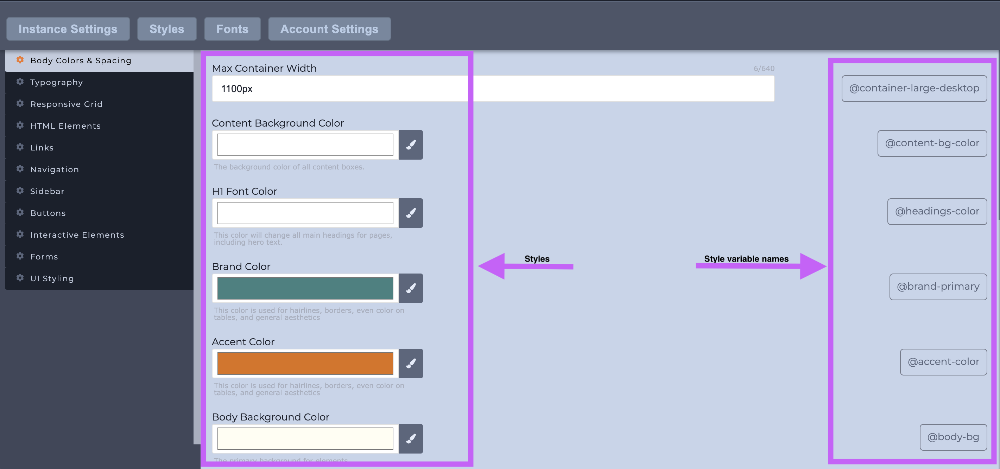
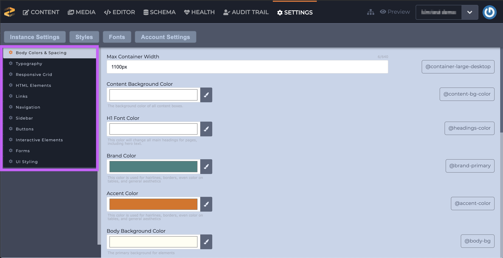
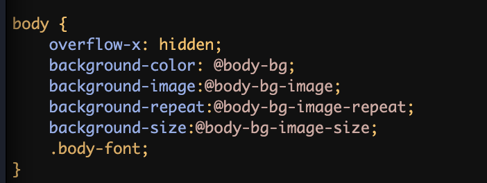

# Instance Styles

## Overview

The Styles subsection will only be available if your blueprint has style variables built-in. A blueprints styles are defined on instance creation via a file called plate-variables.xml. If you do not see a Styles subsection then your blueprint does not have styles.

## What are style variables?

Each of the Styles have an associated variable. That variable is denoted by the `@` followed by its name, for example: `@body-bg`. Each of these variables is defined in the instance's [style sheet](https://zesty.org/services/manager-ui/editor/stylesheets).

## Editing your variables

Styles offer a variety of options from font style to colors. The left-hand sidebar shows all the available categories \(outlined in purple below\).

Once a category is selected from the left-hand navigation the main portion of the screen to the right will show the editable fields for you \(outlined in purple below\) to start customizing the variables.

The available style variables will depend on your selected Blueprint. Once you're finished editing your styles be sure to save them so your changes populate.


In order for the style variables to work they must be added to your style sheet _before_ you edit them.


## Accessing your variables in the Editor

In the Editor section, you can add your style variables to a LESS/SCSS file in the under Style Sheets section. All variable names are listed in the Styles subsection. Add those variable names to your style sheet, for example: `background-color: @body-bg;`.

