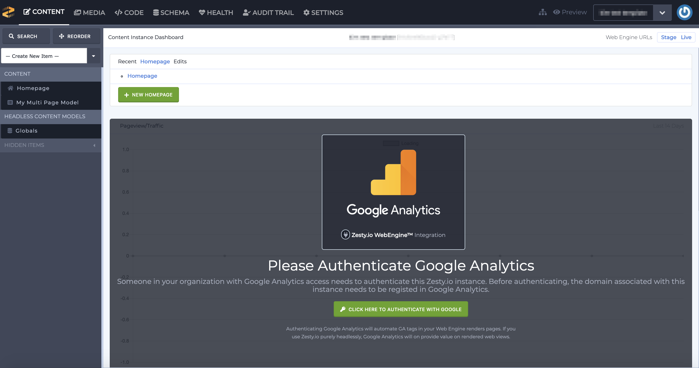
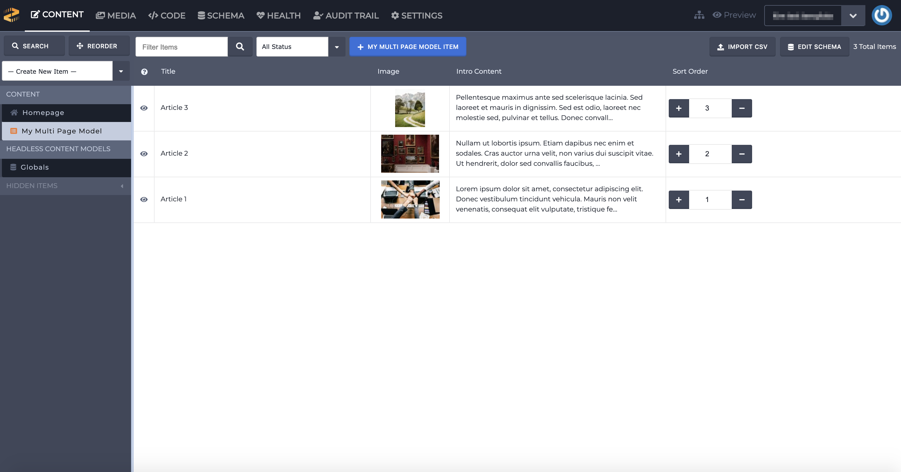
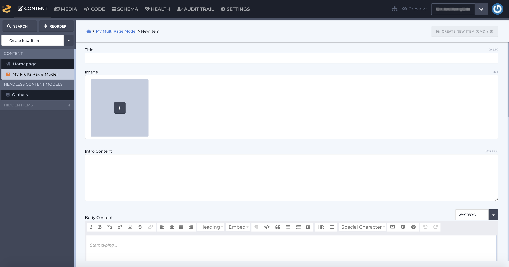
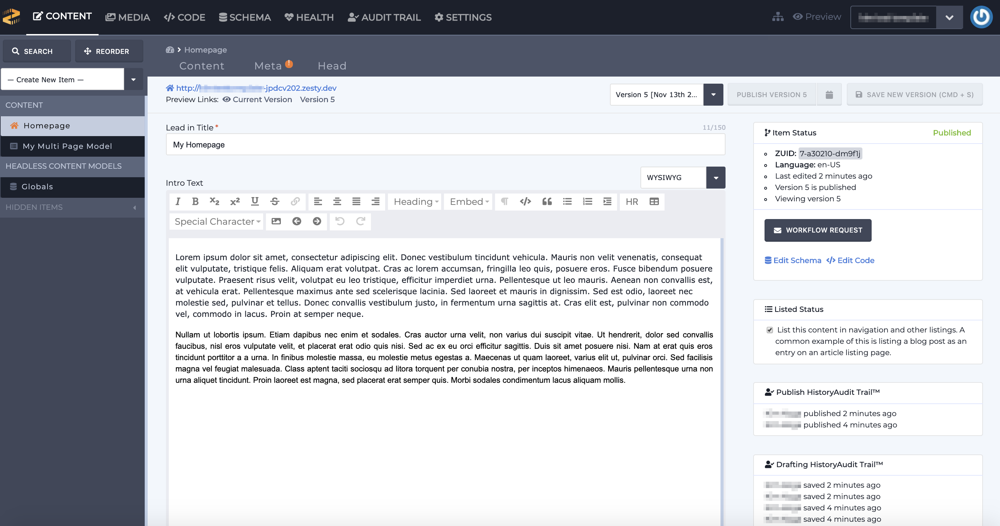

# Content

### Overview

The Content section is generally split into two sections. The left-hand column is the content structure list and it allows users to navigate through their content; it is always available throughout this section. The right-hand section is the main part of the page and its display changes depending on what has been selected. The four types of views are

* Dashboard 
* Table View
* Create New Item/Table Entry View
* Item and Table Entry Editing View

### Dashboard

This is the initial view when you first load the Content section and launch the content manager. The default dashboard shows an overview of key analytics from Google Analytics \(as long as it's been configured\), a list of recently edited entries, and highlights recent news from Zesty.io.

### Table View

This is for multi-page and headless models to show a list of all the entries in the content set. Clicking into an item brings up the Entry Editing view and clicking the blue "+ \[Add New Item\]" button brings up the Create New Item/Table Entry view. You can search, filter,  and update sort order through the table.

### Create New Item/Table Entry View

This view is accessed by clicking the blue "+ \[Add New Item\]" button at the top of the table and through the white "Create New Item" dropdown near the top of the left-hand content structure column. 

This view is similar to the Item/Entry Editing view except all fields are all blank or default \(depending on field type\) and the right-hand publishing status bar is absent. 

Once a user begins to enter content, the grayed out "Create New Item" button in the upper right-hand corner will turn green and allow the user to save and create their new item/entry.

### Item and Entry Editing View

These views show field\(s\) with the current content value\(s\) in the main section and the publishing status bar, which includes publishing history and status, listed status, drafting history, and more, to the right.

